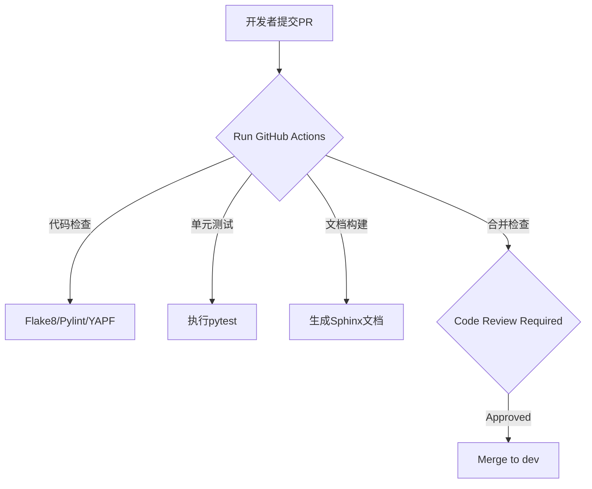

---

# **项目代码管理文档**
**版本：1.0 ｜ 最后更新日期：YYYY-MM-DD**

---

## 1. **代码仓库结构说明**
### 层级目录核心模块
```markdown
├── federatedscope/               # 核心代码层
│   ├── attack/                   # 攻击模块 (隐私/后门/逆向工程)
│   ├── autotune/                 # 自动化调优模块 (HPO)
│   ├── cl/                       # 对比学习相关组件
│   ├── core/                     # 核心引擎 (通信/聚合器/训练器)
│   │   ├── aggregators/          # 联邦聚合算法 (FedAvg/Krum/Median等)
│   │   ├── auxiliaries/          # 构建器工具类 (模型/数据/评估指标构建)
│   │   ├── configs/              # 全局配置管理系统
│   │   └── workers/              # 客户端/服务端基础类
│   ├── cross_backends/           # 分布式计算支持 (TensorFlow/GRPC)
│   ├── cv/                       # 计算机视觉模块
│   ├── gfl/                      # 图联邦学习 (节点/边/图级别训练)
│   ├── vertical_fl/              # 纵向联邦学习 (线性模型/树模型)
│   └── ...                       # 其他功能模块
│
├── benchmark/                    # 基准测试套件
│   ├── B-FHTL/                   # 跨任务联邦测试
│   ├── FedHPOBench/              # HPO调优评估
│   └── pFL-Bench/                # 个性化联邦测试
│
├── environment/                  # 环境依赖管理
│   ├── docker_files/             # 容器化配置文件
│   └── requirements-*.txt        # Python依赖清单
│
├── scripts/                      # 实验脚本集
│   ├── attack_exp_scripts/       # 攻击实验配置
│   ├── optimization_exp_scripts/ # 优化算法实验
│   └── personalization_scripts/  # 个性化联邦实验
│
└── tests/                        # 单元/集成测试模块
```

---

## 2. **代码版本管理规范**
### 分支策略
| 分支类型        | 命名规则          | 用途                             | 合并规则                |
|-----------------|-------------------|----------------------------------|-------------------------|
| **主分支**      | `main`            | 生产就绪代码                     | 仅从release合并         |
| **开发分支**    | `dev`             | 集成分支，阶段性功能测试         | 合并来自feature/<name>  |
| **功能分支**    | `feature/<name>`  | 新功能开发 (如添加DP机制)        | 提PR至dev分支           |
| **修复分支**    | `hotfix/<name>`   | 紧急BUG修复                       | 提PR至main和dev分支     |

### 版本标签规则
- 格式：`v<主版本>.<次版本>.<补丁>` (例: `v2.1.3`)
- 主版本号：架构级变更
- 次版本号：兼容性功能新增
- 补丁号：Bug修复或微小改进

---

## 3. **开发协作规范**
### 代码编写要求
- **Python版本**: 限定3.9+ (需与`environment/requirements.txt`保持一致)
- **命名规范**:
  - 模块/包：小写+下划线 (如`vertical_fl`)
  - 类名：大驼峰式 `FedAvgAggregator`
  - 函数/变量：小写+下划线 `calc_model_gradients`
- **注释规则**:
  - 函数/类需用Google风格docstring
  - 复杂逻辑需添加行内注释
  ```python
  def aggregate_params(self, model_cache):
      """聚合客户端上传的模型参数
      Args:
          model_cache (List[ModelWeights]): 客户端模型参数列表
      Returns:
          AggregatedWeights: 聚合后的全局模型参数
      """
      # 使用加权平均策略
      total_samples = sum([m.num_samples for m in model_cache])
      ...
  ```

### PR提交规范
- **Commit信息**:
  - 类型前缀：`feat(模块名):` / `fix(core):` / `docs:`
  - 示例：`feat(attack): 新增模型逆向攻击训练器`
- **PR检查清单（可选，后续通过其他方式测试都行）**：
  1. 通过单元测试 `pytest tests/`
  2. 代码覆盖率 ≥85% （使用`coverage`工具）
  3. 符合YAPF代码风格 (`./scripts/format_code.sh`)
  4. 更新相关文档 (README/模块注释)

---

## 4. **模块扩展管理**
### 新算法开发流程
**场景示例：添加FedProx算法的改进版**
1. **创建分支**
   `git checkout -b feature/fedprox-plus`

2. **代码扩展**
   - 在 `federatedscope/core/aggregators/` 中添加 `fedprox_plus.py`
   - 在 `federatedscope/core/configs/cfg_fl_algo.py` 添加配置项
   - 更新 `federatedscope/register.py` 注册新算法

3. **测试验证**
   - 新增测试文件 `tests/test_fedprox_plus.py`
   - 添加基准测试配置 `benchmark/pFL-Bench/fedprox-plus.yaml`

4. **提交PR**
   ```bash
   git add .
   git commit -m "feat(aggregator): Implement FedProx+ aggregation"
   git push origin feature/fedprox-plus
   ```
5. **建立PR至`dev`分支**，附上相关的报告

---

## 5. **自动化工具链**
### CI/CD 流程


### 关键工具配置
| 工具类型       | 配置文件                 | 用途                       |
|----------------|--------------------------|----------------------------|
| **代码风格**   | `.flake8` `.style.yapf`  | 统一代码格式               |
| **提交钩子**   | `.pre-commit-config.yaml`| 自动检查Commit前代码规范   |
| **依赖管理**   | `environment/*.txt`      | 冻结Python依赖版本         |
| **文档生成**   | `doc/source/conf.py`     | 生成HTML/PDF格式文档       |

---

## 6. **关键管理策略**
### 代码审查机制
- **双人审核**：每个PR需至少2名核心成员批准
- **审查重点**：
  - 架构合理性（是否符合事件驱动设计）
  - 性能影响（内存/通信开销分析）
  - 向后兼容性（配置系统兼容旧版本）

### 紧急问题处理
- **Hotfix通道**：严重BUG直接提交至`hotfix/`分支，验证后合并至`main`
- **回归测试**：修复后需运行完整测试套件
  ```bash
  pytest tests/ -v --cov=federatedscope --cov-report=html
  ```

---

## 7. **扩展建议**
### 代码热区监控
- **关注模块**：
  - `core/workers/` (客户端/服务端通信逻辑)
  - `core/auxiliaries/` (构建器模式的核心)
  - `vertical_fl/tree_based_models/` (高频修改区)

### 架构扩展点
- **注册机制**：使用 `register.py` 添加新模块
- **配置驱动**：新增YAML配置项而非硬编码
- **事件扩展**：在`core/workers/base_worker.py`中添加事件处理器

---
